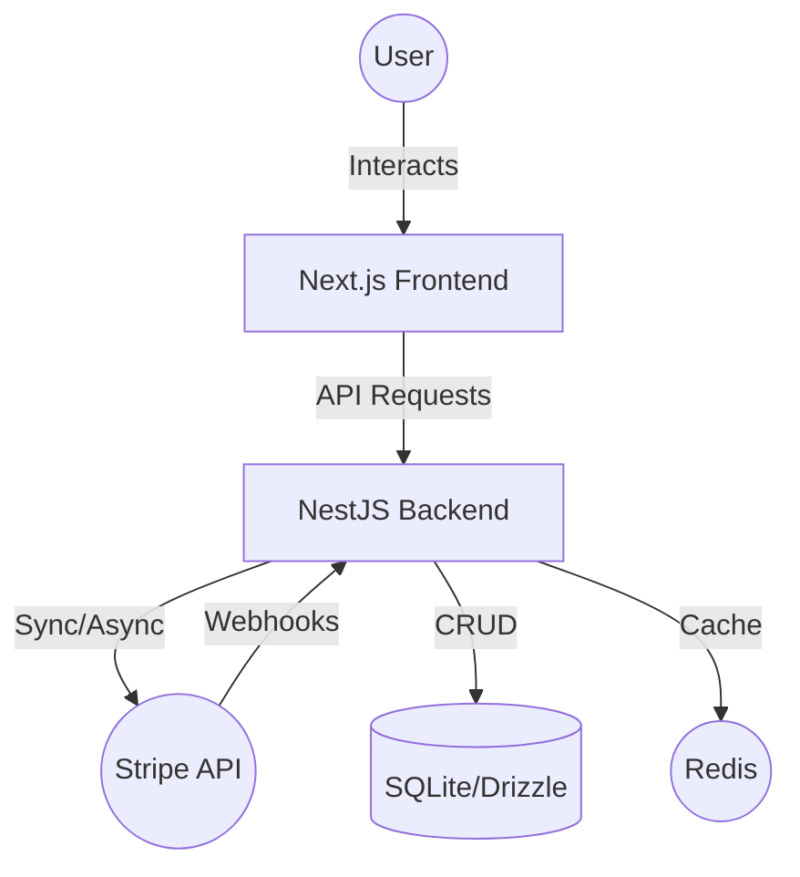

# SYSTEM_DESIGN.md

## 1. High-Level Data Flow

## 2. Core Components

### 2.1 Backend (NestJS)
- **API Layer**: Express-based controllers with Swagger documentation.
- **Service Layer**: Business logic encapsulated in domain-specific services (Payments, Billing, etc.).
- **Data Access Layer**: Drizzle ORM providing type-safe access to SQLite.
- **Integration Layer**: Dedicated `StripeClient` wrapper for the official SDK.

### 2.2 Frontend (Next.js)
- **App Router**: Organized routing with nested layouts for Admin experience.
- **Stripe Elements**: Integrated via `@stripe/react-stripe-js` for PCI-compliant payment collection.
- **Tailwind v4**: Next-gen styling with simplified configuration.

## 3. Reliability Patterns

### 3.1 Idempotency
All sensitive POST operations (e.g., creating a payment) support the `Idempotency-Key` header. This prevents duplicate charges in case of network retries.

### 3.2 Outbox Pattern
Domain events are saved to the `integration_outbox` table within the same database transaction as the primary change. A background worker then processes these events, ensuring "at-least-once" delivery to downstream systems.

### 3.3 Customer Data Caching
Customer records and billing status are cached in Redis to minimize database lookups and latency during high-traffic periods.

## 4. Observability
- **Distributed Tracing**: OpenTelemetry spans wrap all incoming requests and outgoing Stripe/DB calls.
- **Structured Logging**: JSON logs via Pino, including `requestId` and `traceId` correlation.
- **Health Checks**: `/health` endpoint for readiness/liveness probes.
